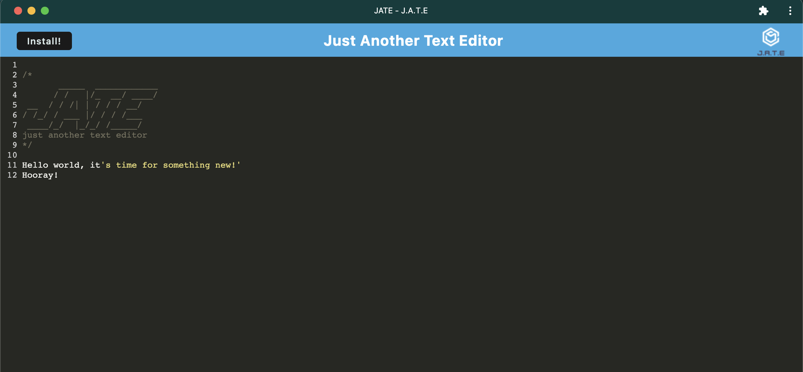

# 19: "JATE" - PWA text editor

#### Licensed under [MIT](LICENSE)

## Table of Contents

- [Project Description](#project-description)
- [Usage](#usage-instructions)
- [Links](#links)

## Project Description

This node.js program uses the Express.js, mutiple webpacks and service workers to create a persistant web application that can also be downloaded as an app on the user's machine for use while offline

## Usage Instructions

### Locally hosting

Be sure your package.json files have been appropriately copied over, then enter <code>npm i</code> to install dependencies. Open your terminal in the root directory of this project and the enter <code>npm run start</code> command to start up the backend and serve the client.

When this command is entered, the html, css, and javascript files will be bundled using webpack, along with a service worker and manifest file.

### Using the site

Navigate to the live webpage to use this simple text editor! Write your heart out knowing that your words will be preserved with the power of local storage, indexdb, and a service worker.

Want access to your work while offline? Click the 'install' button at the top of the page to install JATE as an app-icon on your machine

### Functionality includes:

- Supports next-gen Javascript
- Persistant data using Local Storage and IndexDB
- Download this web app to your desktop to use anytime!

## Links

- Repository: https://github.com/Sarahlophus/JATE-textedit
- Live Page (Heroku):https://jaterade.herokuapp.com/
